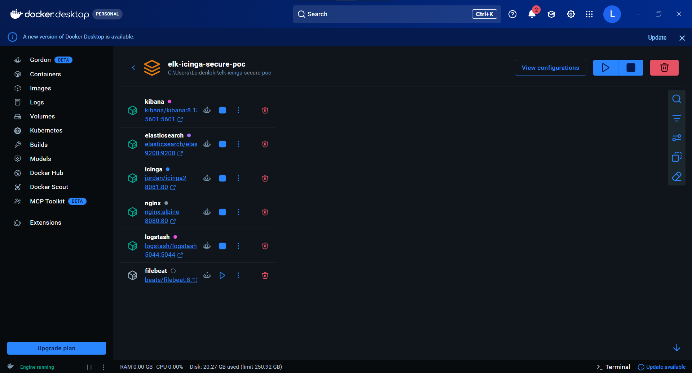
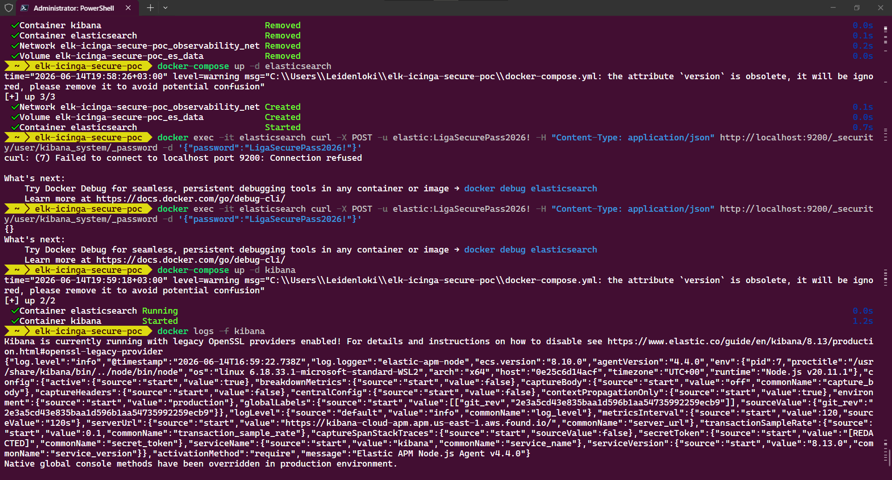
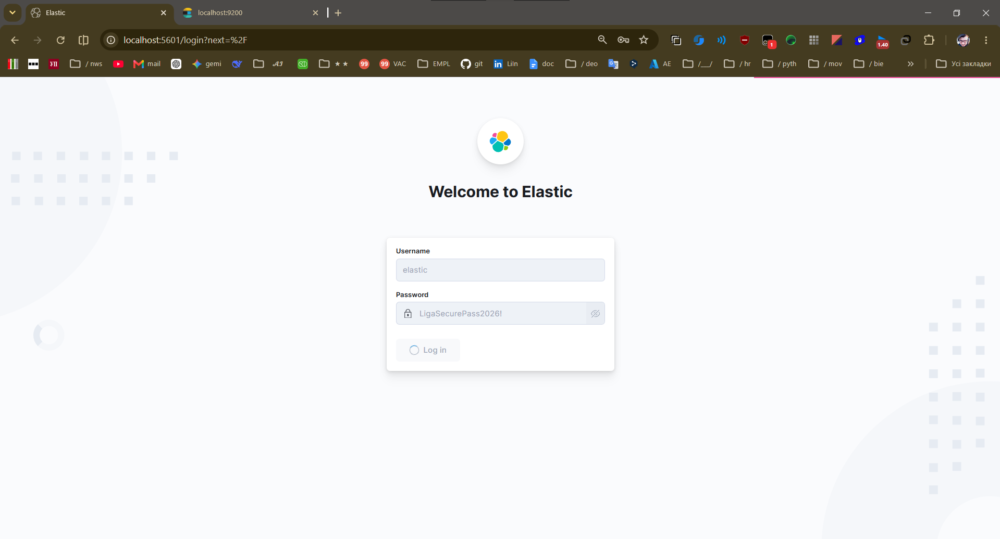
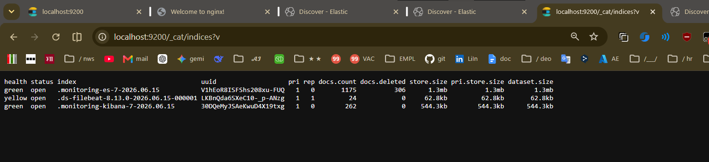
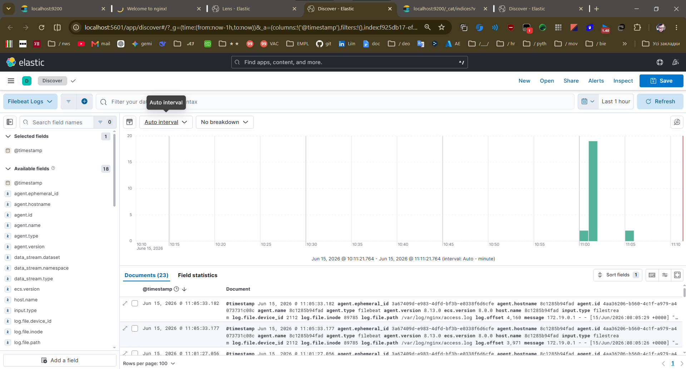
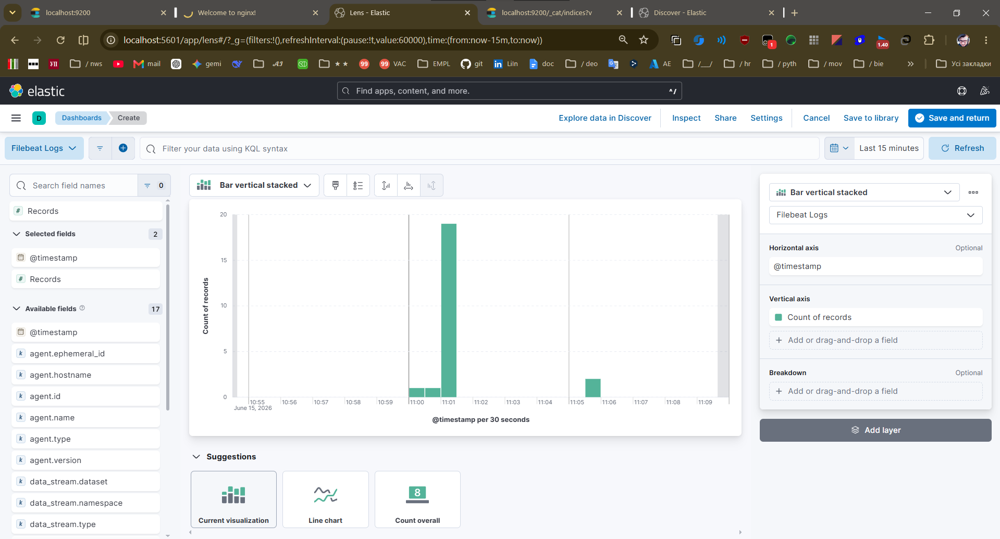
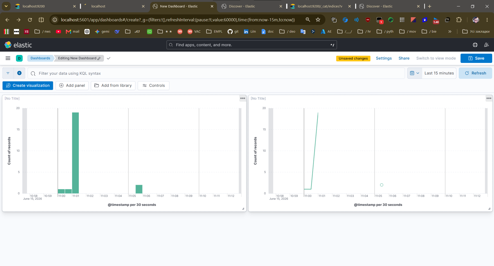

# Secure EFK Stack (Elasticsearch, Filebeat, Kibana) for Nginx Observability


**Architected and implemented by Leonid Lachmann**

A highly optimized, secure, and lightweight log management and observability pipeline deployed via Docker Compose.

## 🎯 Project Objective
The primary goal of this project is to deploy a robust observability stack capable of running in resource-constrained environments (e.g., edge servers or local development machines).

Initially architected as a traditional ELK stack, the system encountered Out-Of-Memory (OOM) constraints due to the heavy JVM footprint of Logstash. To ensure high availability and stability, the architecture was intentionally refactored to an **EFK stack**. By removing Logstash and configuring Filebeat to route logs directly to Elasticsearch, overall RAM consumption was reduced significantly while maintaining full log parsing capabilities.

## 🏗️ Architecture
* **Nginx (Alpine):** Configured to write physical access and error logs for ingestion.
* **Filebeat:** Lightweight shipper configured to parse Nginx logs and forward them directly to Elasticsearch via the `filestream` input.
* **Elasticsearch (Single-Node):** Core search engine configured with `xpack.security` for native authentication.
* **Kibana:** UI for data discovery, monitoring, and real-time visualization.

---

## 📸 Technical Showcase & Implementation Details

### 1. Resource Optimization & Infrastructure Launch
The infrastructure is containerized and orchestrated via Docker Compose. The refactored architecture allows the entire observability network to spin up quickly and run smoothly without overwhelming the host Docker engine.


### 2. Security Configuration via API
Security is implemented at the core. System passwords and authentication tokens were generated and injected directly via the Elasticsearch REST API using terminal commands, bypassing default insecure setups.


This ensures that Kibana and the underlying data indices are fully protected by user authentication.


### 3. Backend Health & Data Ingestion
Direct validation of the Elasticsearch backend using the `_cat/indices` API confirms that Filebeat successfully created the datastreams (`.ds-filebeat-*`) and is actively indexing documents.


### 4. Log Parsing & Discovery
Nginx access logs are successfully ingested, parsed, and mapped to the `@timestamp` field. The Discover module natively visualizes traffic spikes using auto-interval tracking alongside the parsed document metrics.


### 5. Advanced Data Visualization (Kibana Lens)
Utilized Kibana Lens to construct custom vertical stacked bar charts, defining axes and distributions based on specific log fields for deeper traffic analysis.


### 6. Custom Monitoring Dashboards
Created dedicated operational dashboards aggregating multiple visual panels, allowing for at-a-glance monitoring of HTTP request distribution and server activity.


---

## 🚀 Quick Start Guide

**1. Clone the repository and navigate to the directory:**
```bash
git clone <your-repository-url>
cd elk-icinga-secure-poc
```

**2. Optimize Host Memory Limits (Linux/WSL):**
Elasticsearch requires a higher virtual memory map count to function correctly:
```bash
sudo sysctl -w vm.max_map_count=262144
```

**3. Launch the Infrastructure:**
```bash
docker-compose up -d
```

**4. Generate Traffic:**
Visit `http://localhost:8080` and refresh multiple times to generate fresh Nginx access logs.

**5. Access the Dashboard:**
Navigate to `http://localhost:5601`. When prompted to create a Data View, use the index pattern `filebeat-*` and set the primary time field to `@timestamp`.